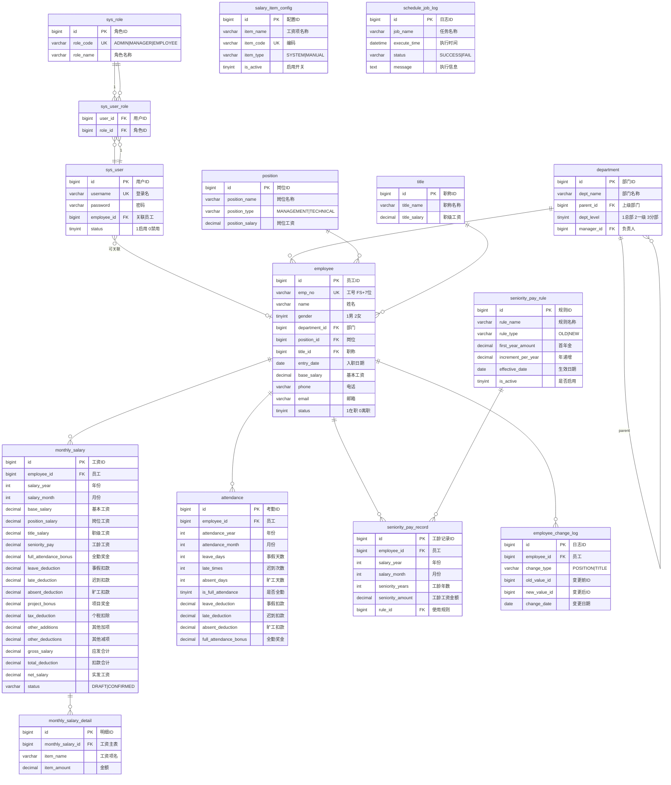

# 工资管理系统 - E-R 概念模型

## 实体关系说明

| 关系 | 类型 | 说明 |
|------|------|------|
| 用户 → 角色 | 多对多 | 一个用户可有多个角色 |
| 部门 → 部门 | 自引用一对多 | parent_id 自关联，支持多级树 |
| 部门 → 员工 | 一对多 | 一个部门有多个员工 |
| 岗位 → 员工 | 一对多 | 一个岗位可分配给多个员工 |
| 职称 → 员工 | 一对多 | 一个职称可分配给多个员工 |
| 员工 → 月度工资 | 一对多 | 一个员工每月一条工资记录 |
| 员工 → 考勤 | 一对多 | 一个员工每月一条考勤记录 |
| 员工 → 工龄工资 | 一对多 | 一个员工每月一条工龄记录 |
| 员工 → 变更日志 | 一对多 | 岗位/职称变更的历史记录 |
| 工龄规则 → 工龄记录 | 一对多 | 每次计算关联使用的规则 |
| 月度工资 → 工资明细 | 一对多 | 主表拆分明细项 |

## 业务约束

- **考勤唯一**：同一员工同一年月只能有一条考勤
- **工资唯一**：同一员工同一年月只能有一条工资记录
- **工龄唯一**：同一员工同一年月只能有一条工龄记录
- **已确认锁定**：工资确认后不可修改（存储过程跳过）
- **部门级联**：删除部门前检查子部门和员工
- **员工级联**：删除员工自动清理关联数据
